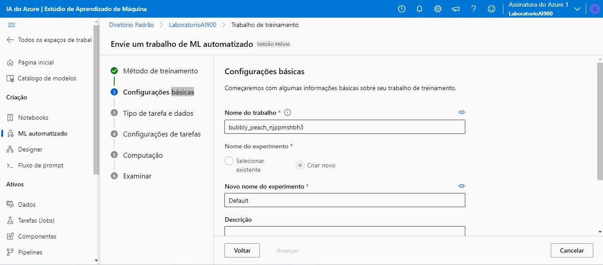

# MLAzure-AI900

## Projeto DIO: Trabalhando com Machine Learning na Prática no Azure ML 

Links:

[Explore Azure AI Services](https://microsoftlearning.github.io/mslearn-ai-fundamentals/Instructions/Labs/02-content-safety.html)

[Explore Automated Machine Learning in Azure Machine Learning](https://microsoftlearning.github.io/mslearn-ai-fundamentals/Instructions/Labs/01-machine-learning.html)

[Fonte dos dados](https://aka.ms/bike-rentals) ou [link direto para os dados](https://raw.githubusercontent.com/MicrosoftLearning/mslearn-ai-fundamentals/main/data/ml/daily-bike-share.csv)

### Atividade:
1 - Criando recurso do Azure Machine Learning

Para isso, clique em "Criar recurso" e depois pesquise por Azure Machine Learning no marketplace. Após encontrar o recurso, crie ele.

2 - Configurar o recurso do Azure Machine Learning

Na aba de Noções básica, Detalhes do recurso, informe a assinatura para cobrança no campo Assinatura e depois o Grupo de recursos que vai englobar o recurso que será criado.

Após, em Detalhes da área de trabalho, informe os detalhes do workspace que será criado. Por fim, crie o recurso clicando em **Consultar + criar**. Após a validação ser aprovada, cliquei em "Criar".

Após o recurso ser criado, clicar no botão "Ir para o recurso" para acessar a página do recurso.

Nessa página, existe o botão "Iniciar o estúdio" que redirecionará para o estúdio do Azure Machine Learning.

3 - Criando o modelo

No estúdio, na página do workspace criado anteriormente, acessar a opção do menu ML automatizado e na página aberto, cliquei em "Novo trabalho de ML automatizado".

Em "Configurações básicas", preencher os campos "Nome do trabalho", "Novo nome do experimento" e "Descrição". Após clique em "Avançar".

No passo "Tipo de tarefa e dados", selecionar o tipo de tarefa como **Regressão** e em seguida, em "Selecionar dados", clique em "Criar". No modal aberto, em "Tipos de dados", preencher os campos **"Nome", "Descrição" e escolhi "Tipo" como Tabular**. Clique em "Avançar" e no passo "Fonte de dados", escolher "De arquivos da Web" e clique em avançar novamente.

No passo "URL da Web", informar a URL [https://aka.ms/bike-rentals](https://aka.ms/bike-rentals) do conjunto de dados. 
Observação:  o link não está funcional, por isso, use essa URL: [https://raw.githubusercontent.com/MicrosoftLearning/mslearn-ai-fundamentals/main/data/ml/daily-bike-share.csv](https://raw.githubusercontent.com/MicrosoftLearning/mslearn-ai-fundamentals/main/data/ml/daily-bike-share.csv). No passo "Configurações", preenchar as configurações do conjunto e após avançar para "Esquema", verifique os tipos de dados. Finalmente, ao avançar, verifique as configurações criadas para o ativo de dados e clique em criar.

Em "Configurações de tarefas", escolha o conjunto de dados importado. Após, em "Coluna de destino" escolha a coluna rentals como target.

Nos campos de "Limite", preencha com os valores abaixo e marque **"Habilitar encerramento antecipado"**.

Em "Validar e testar", em "Tipo de validação" escolha **"Divisão de validação de treinamento"**.

Ao avançar, em Computação, mantenha os valores mostrados na imagem abaixo.

Após avançar e examinar as configurações do trabalho, clique em **"Enviar trabalho de treinamento"**.

Após finalizar o trabalho de treinamento, crie o modelo. Para isso, acesse a página do trabalho realizado e cliquei em "Modelo de registro". Deixe as opções padrões para "Selecionar saída". Em "Configurações do modelo", somente preencha o nome e a versão. Após isso, clique em criar o modelo.

Por fim, o modelo fica acessível na opção de menu "Modelo".

4 - Métricas do modelo

Para acessar as métricas do modelo treinado, na página do modelo, acesse o link informado em "Criado por trabalho". Também é possível acessar o trabalho informado na opção do menu "Tarefas (jobs)".

Na página da tarefa, acesse a aba métricas.

5 - Teste do modelo
Na página do modelo, acesse a aba "Pontos de extremidade" e em seguida clique em "Implantar". Em seguida marque o modelo e deixe todos os campos seguintes como os valores padrões, exceto "Contagem de instâncias" que deixe como 1. Então clique em "Implantar".

Logo após a implantação, acesse a aba "Testar" do ponto de extremidade criado para o meu modelo.

Para o teste, utilize o json abaixo:

<code>
{
  "input_data": {
    "data": [
       {
         "day": 1,
         "mnth": 1,   
         "year": 2022,
         "season": 2,
         "holiday": 0,
         "weekday": 1,
         "workingday": 1,
         "weathersit": 2, 
         "temp": 0.3, 
         "atemp": 0.3,
         "hum": 0.3,
         "windspeed": 0.3 
       }
     ]
  }
}
</code>

A previsão gerada foi: 361.95

